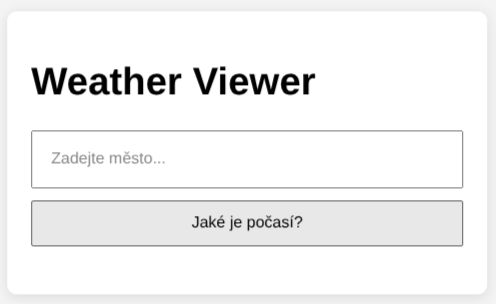
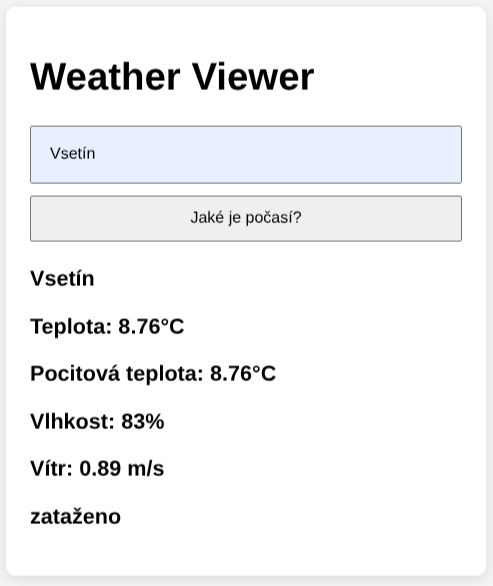

# ⛅ Weather Viewer
Jednoduchá webová aplikace napsaná v **HTML, CSS a JavaScriptu**, která umožňuje vyhledat aktuální počasí podle názvu města. Data jsou získávána přes **OpenWeatherMap API** pomocí **fetch()**.

### Funkce
- Vyhledání počasí podle města
- Zobrazení teploty, pocitové teploty, větru a vlhkosti
- Lokální zobrazení popisu počasí
- Jednoduchý a čistý design
- Zpracování chyb (špatně zadané město, nedostupná odpověď API)

### Live Demo
Demo na Github Pages - [ZDE](https://heysmtk.github.io/weather-viewer/)

### Instalace a spuštění
1. Naklonuj repozitář:
```bash
git clone https://github.com/heysmtk/weather-viewer.git
```
2. Vstup do projektu
```bash
cd weather-viewer
```
3. Otevři `index.html` v prohlížeči

### Vlastní API key
1. Zaregistruj se zdarma na: https://openweathermap.org/
2. Vytvoř si API klíč
3. V app.js nahraď:
````javascript
const API_KEY = "TVŮJ_API_KEY";
```

### Screenshots



### MIT License
Aplikace lze upravovat, používat i šířit.